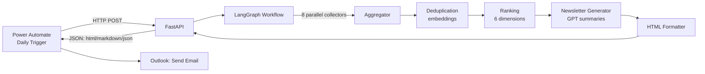

# AI Newsletter Automation

Enterprise multi-agent AI newsletter platform built with **LangGraph**,
**FastAPI**, and **OpenAI/Azure OpenAI**, delivered daily through
**Microsoft Power Automate** and **Outlook**. It automatically discovers,
categorizes, deduplicates, ranks, summarizes, and formats AI industry news
into an executive-ready newsletter — with zero manual steps.

[](https://github.com/Irapatil/AI-Newsletter-Automation/actions/workflows/ci.yml)
[](https://www.python.org/)
[](https://fastapi.tiangolo.com/)
[](https://github.com/langchain-ai/langgraph)
[](LICENSE)

## Table of Contents

- [Business Problem](#business-problem)
- [Solution](#solution)
- [Architecture](#architecture)
- [Technology Stack](#technology-stack)
- [Folder Structure](#folder-structure)
- [Installation](#installation)
- [Configuration](#configuration)
- [API Usage](#api-usage)
- [Running with Docker](#running-with-docker)
- [Power Automate Integration](#power-automate-integration)
- [Testing & Code Quality](#testing--code-quality)
- [Documentation](#documentation)
- [Future Enhancements](#future-enhancements)
- [Screenshots](#screenshots)
- [License](#license)

## Business Problem

Staying current on AI industry news — model releases, funding, research,
hiring trends, open-source activity, and regulation — is a full-time job in
itself. Manually curating a daily executive digest from a dozen+ scattered
sources doesn't scale, is inconsistent, and is the kind of repetitive
knowledge-work task that's a natural fit for automation.

## Solution

A LangGraph-orchestrated pipeline runs on a schedule (triggered by Power
Automate), fans out to **eight parallel collector agents** across global
news, company moves, funding, talent, research, open source, policy, and
model releases, then:

1. **Aggregates** everything into one list.
2. **Deduplicates** semantically (embedding cosine similarity) — the same
   story covered by five publishers becomes one entry.
3. **Ranks** every remaining story across six weighted dimensions
   (freshness, importance, business impact, source credibility, research
   impact, AI relevance).
4. **Summarizes** the top stories with GPT into a tight executive voice.
5. **Renders** the result as HTML, Markdown, and JSON.
6. **Serves** it over a FastAPI endpoint that Power Automate calls daily and
   pipes straight into an Outlook "Send an email" action.

Every external dependency (LLM, news APIs, job boards, funding data) has a
mock or free fallback, so the entire pipeline runs and is fully testable
**before you add a single API key**.

## Architecture



See [`docs/ARCHITECTURE.md`](docs/ARCHITECTURE.md) for the full agent graph,
sequence diagram, and a breakdown of the ranking/deduplication algorithms —
and why this is built on LangGraph rather than a conversational-agent
framework like AutoGen.

## Technology Stack

| Layer | Technology |
|---|---|
| Orchestration | LangGraph (`StateGraph`, parallel fan-out/fan-in, conditional edges, retry policies) |
| LLM | OpenAI / Azure OpenAI via LangChain, with a deterministic offline mock provider |
| API | FastAPI + Pydantic v2 |
| News collection | `feedparser` (RSS/Atom), `httpx` (async HTTP), `BeautifulSoup4` |
| Sources | Google News RSS, arXiv API, GitHub Search API, Hugging Face Hub API, Greenhouse/Lever job board APIs, NewsAPI.org, Crunchbase API v4 |
| Rendering | Jinja2 (HTML email template), custom Markdown builder |
| Config | `pydantic-settings`, `.env` |
| Logging | `structlog` (structured JSON logs) |
| Testing | `pytest`, `pytest-asyncio`, `respx` (HTTP mocking), `pytest-cov` |
| Quality | `black`, `ruff`, `isort`, `mypy` |
| Packaging | Docker, docker-compose, Makefile |

## Folder Structure

```
app/
├── api/          FastAPI routes + auth dependency
├── agents/       13 agents: 8 collectors + aggregator/dedup/ranking/newsletter/formatter
├── graph/        LangGraph StateGraph construction (workflow.py, nodes.py)
├── services/     External integrations (LLM, RSS, arXiv, GitHub, HF, job boards, funding, history)
├── models/       Pydantic domain models + GraphState
├── config/       Settings, source registry, logging config
├── utils/        Retry decorator, text/embedding helpers
└── templates/    Jinja2 HTML email template
```

Full breakdown: [`docs/FOLDER_STRUCTURE.md`](docs/FOLDER_STRUCTURE.md).

## Installation

```bash
git clone https://github.com/Irapatil/AI-Newsletter-Automation.git
cd AI-Newsletter-Automation

python -m venv .venv
source .venv/bin/activate        # Windows: .venv\Scripts\activate

pip install -r requirements-dev.txt
cp .env.example .env
```

Run it immediately — no API keys required (mock LLM + free/fallback sources):

```bash
make dev
# -> http://localhost:8000/docs
```

## Configuration

All configuration is via environment variables (`.env`). Every field has a
safe default; see [`docs/ENVIRONMENT_VARIABLES.md`](docs/ENVIRONMENT_VARIABLES.md)
for the full reference. The highlights:

```bash
# Enable real GPT summaries + embeddings
OPENAI_API_KEY=sk-...
OPENAI_MODEL=gpt-4o

# Protect the API (required in production)
API_AUTH_TOKEN=$(openssl rand -hex 32)

# Optional: raise GitHub rate limits, enable NewsAPI/Crunchbase supplements
GITHUB_TOKEN=
NEWSAPI_API_KEY=
CRUNCHBASE_API_KEY=
```

## API Usage

```bash
# Trigger a full pipeline run
curl -X POST http://localhost:8000/generate-newsletter \
  -H "Content-Type: application/json" \
  -H "X-API-Key: $API_AUTH_TOKEN" \
  -d '{}'

# Fetch the most recent newsletter
curl http://localhost:8000/newsletter/latest -H "X-API-Key: $API_AUTH_TOKEN"

# Fetch generation history
curl http://localhost:8000/newsletter/history -H "X-API-Key: $API_AUTH_TOKEN"
```

Full endpoint reference (request/response schemas, error codes):
[`docs/API.md`](docs/API.md). Interactive docs at `/docs` while the app is running.

Prefer not to stand up the API at all? Run the pipeline directly:

```bash
python scripts/generate_newsletter_cli.py --output-dir newsletter_output
```

## Running with Docker

```bash
cp .env.example .env
make docker-build
make docker-up
make docker-logs
```

See [`docs/DEPLOYMENT.md`](docs/DEPLOYMENT.md) for cloud deployment patterns
(Azure Container Apps, ECS, Kubernetes) and secrets guidance.

## Power Automate Integration

```
Daily Trigger (Recurrence) → HTTP (POST /generate-newsletter) → Parse JSON
      → Compose (HTML) → Outlook: Send an email (V2) → (optional) SharePoint archive
```

Full step-by-step flow setup, with the exact JSON schema for the Parse JSON
step and screenshot placeholders for each action:
[`docs/POWER_AUTOMATE.md`](docs/POWER_AUTOMATE.md).

## Testing & Code Quality

```bash
make test        # pytest, 138 tests (including an end-to-end LangGraph run), all external calls mocked (respx / MockLLMService)
make lint         # ruff + isort --check + black --check
make format       # ruff --fix + isort + black
make typecheck    # mypy
make check        # lint + typecheck + test
```

No network access or API keys are required to run the test suite — outbound
HTTP is mocked with `respx`, and the LLM defaults to `MockLLMService`.
[`.github/workflows/ci.yml`](.github/workflows/ci.yml) runs the same `make check`
steps on every push and pull request to `main`.

## Documentation

| Doc | Contents |
|---|---|
| [`docs/ARCHITECTURE.md`](docs/ARCHITECTURE.md) | Agent graph, sequence diagram, dedup/ranking algorithms |
| [`docs/API.md`](docs/API.md) | Endpoint reference, auth, error codes |
| [`docs/DEPLOYMENT.md`](docs/DEPLOYMENT.md) | Local, Docker, and cloud deployment |
| [`docs/POWER_AUTOMATE.md`](docs/POWER_AUTOMATE.md) | Step-by-step Power Automate flow |
| [`docs/ENVIRONMENT_VARIABLES.md`](docs/ENVIRONMENT_VARIABLES.md) | Full env var reference |
| [`docs/FOLDER_STRUCTURE.md`](docs/FOLDER_STRUCTURE.md) | Full repository layout |
| [`docs/TROUBLESHOOTING.md`](docs/TROUBLESHOOTING.md) | Common issues and fixes |
| [`docs/ROADMAP.md`](docs/ROADMAP.md) | Planned enhancements |

## Future Enhancements

Per-recipient personalization, LangGraph checkpointing for resumable runs,
a real LinkedIn Talent API integration, database-backed history for
multi-instance deployments, and multi-language newsletters. Full list:
[`docs/ROADMAP.md`](docs/ROADMAP.md).

## Screenshots

> `docs/images/newsletter-html-preview.png` — *(placeholder: rendered HTML newsletter)*
>
> `docs/images/swagger-ui.png` — *(placeholder: FastAPI `/docs` Swagger UI)*
>
> `docs/images/power-automate-flow-overview.png` — *(placeholder: end-to-end Power Automate flow canvas)*

## License

[MIT](LICENSE) © 2026 Irapatil
