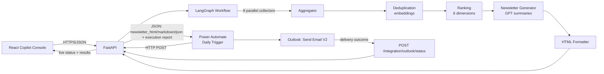

# AI Newsletter Automation

Enterprise multi-agent AI newsletter platform built with **LangGraph**,
**FastAPI**, **React**, and **OpenAI/Azure OpenAI**, delivered daily
through **Microsoft Power Automate** and **Office 365 Outlook**. It
automatically discovers, deduplicates, ranks, summarizes, and formats AI
industry news into an executive-ready newsletter — with zero manual steps
after deployment.

[](https://github.com/Irapatil/AI-Newsletter-Automation/actions/workflows/ci.yml)
[](https://www.python.org/)
[](https://fastapi.tiangolo.com/)
[](https://github.com/langchain-ai/langgraph)
[](https://react.dev/)
[](LICENSE)

## Table of Contents

- [Project Overview](#project-overview)
- [Architecture](#architecture)
- [Features](#features)
- [Screenshots](#screenshots)
- [Technology Stack](#technology-stack)
- [Installation](#installation)
- [Environment Variables](#environment-variables)
- [Running the Backend](#running-the-backend)
- [Running the Frontend](#running-the-frontend)
- [Power Automate Integration](#power-automate-integration)
- [Outlook Integration](#outlook-integration)
- [Folder Structure](#folder-structure)
- [Documentation](#documentation)
- [Testing & Code Quality](#testing--code-quality)
- [Future Enhancements](#future-enhancements)
- [License](#license)
- [Author](#author)

## Project Overview

Staying current on AI industry news — model releases, funding, research,
hiring trends, open-source activity, and regulation — requires monitoring
dozens of scattered sources every day. This platform automates that
entirely: eight specialized agents collect from live sources in parallel,
a LangGraph pipeline deduplicates and ranks the results semantically, and
GPT produces an executive-ready newsletter — delivered to Outlook every
morning via Microsoft Power Automate, with real delivery-status feedback
reflected live in the console.

Full business case: [`docs/01_Project_Overview.md`](docs/01_Project_Overview.md).

## Architecture



See [`docs/02_System_Architecture.md`](docs/02_System_Architecture.md) for
the full component breakdown, and
[`docs/ARCHITECTURE.md`](docs/ARCHITECTURE.md) for the underlying LangGraph
agent graph and sequence diagram.

### LangGraph Workflow

```
START → Orchestrator → [8 parallel collector agents] → Aggregator
      → Semantic Deduplication → Ranking
      → (conditional) Newsletter Generator | NoContentFallback
      → HTML Formatter → END
```

Every node is instrumented with a stopwatch that reports its `status`,
`execution_time_seconds`, and `items_processed` — surfaced directly in the
API response as `agent_execution` and animated live in the frontend. This
is pure observability layered around each agent's existing call; no
routing, retry behavior, or agent logic changes to add it. Full technical
walkthrough: [`docs/03_AI_Pipeline.md`](docs/03_AI_Pipeline.md).

## Features

- **8 parallel collector agents** across global news, company moves,
  funding, research, talent, policy, open source, and model releases.
- **Semantic deduplication** via embedding cosine similarity — the same
  story from five publishers becomes one entry.
- **6-dimension weighted ranking** (freshness, importance, business
  impact, source credibility, research impact, AI relevance).
- **GPT-generated executive summary**, per-article summaries, subject
  line, and a highlighted "one thing to watch."
- **Multi-format output** — HTML, Markdown, and structured JSON per run.
- **Full execution telemetry** — every run reports per-agent timing and
  item counts, both via the API and animated live in the console.
- **Real Outlook delivery tracking** — Power Automate reports real
  delivery status back to the platform; the console reflects it live,
  never a hardcoded value.
- **Resilient collection** — a failing source never aborts the run; the
  pipeline degrades to `partial_success` instead.
- **Chat-first React console** — trigger runs, watch execution, and
  monitor delivery without needing Swagger.

## Screenshots

> `docs/images/copilot-console-home.png` — *(placeholder: Copilot console home page with a completed newsletter generation)*
>
> `docs/images/power-automate-console.png` — *(placeholder: Power Automate page mid-execution with the workflow step console)*
>
> `docs/images/outlook-delivery-connected.png` — *(placeholder: Outlook Delivery card showing a real "Connected" / "Email Delivered Successfully" state)*
>
> `docs/images/swagger-ui.png` — *(placeholder: FastAPI `/docs` Swagger UI, showing `POST /demo/generate`'s example response)*
>
> `docs/images/newsletter-html-preview.png` — *(placeholder: rendered HTML newsletter)*

## Technology Stack

| Layer | Technology |
|---|---|
| Frontend | React 18, TypeScript, Vite, Tailwind CSS, Framer Motion, TanStack React Query |
| Orchestration | LangGraph (`StateGraph`, parallel fan-out/fan-in, conditional edges, retry policies) |
| LLM | OpenAI / Azure OpenAI via LangChain, with a deterministic offline mock provider |
| API | FastAPI + Pydantic v2, fully documented OpenAPI/Swagger schema |
| News collection | `feedparser` (RSS/Atom), `httpx` (async HTTP), `BeautifulSoup4` |
| Sources | Google News RSS, arXiv API, GitHub Search API, Hugging Face Hub API, Greenhouse/Lever job board APIs, NewsAPI.org, Crunchbase API v4 |
| Rendering | Jinja2 (HTML email template), `markdown2` |
| Automation & Delivery | Microsoft Power Automate, Office 365 Outlook connector |
| Config | `pydantic-settings`, `.env` |
| Logging | `structlog` (structured JSON logs) |
| Testing | `pytest`, `pytest-asyncio`, `respx` (HTTP mocking), `pytest-cov` |
| Quality | `black`, `ruff`, `isort`, `mypy`, ESLint, `tsc` |
| Packaging | Docker, docker-compose, Makefile |

Full table with every dependency: [`docs/04_Tech_Stack.md`](docs/04_Tech_Stack.md).

## Installation

```bash
git clone https://github.com/Irapatil/AI-Newsletter-Automation.git
cd AI-Newsletter-Automation

python -m venv .venv
source .venv/bin/activate        # Windows: .venv\Scripts\activate

pip install -r requirements-dev.txt
cp .env.example .env
```

Runs immediately — no API keys required (mock LLM + free/fallback
sources).

## Environment Variables

All configuration is via environment variables (`.env`). Every field has a
safe default; see
[`docs/ENVIRONMENT_VARIABLES.md`](docs/ENVIRONMENT_VARIABLES.md) for the
full reference. The highlights:

```bash
# Enable real GPT summaries + embeddings
OPENAI_API_KEY=sk-...
OPENAI_MODEL=gpt-4o

# Protect the API (only enforced when APP_ENV=production)
API_AUTH_TOKEN=$(openssl rand -hex 32)

# Optional: raise GitHub rate limits, enable NewsAPI/Crunchbase supplements
GITHUB_TOKEN=
NEWSAPI_API_KEY=
CRUNCHBASE_API_KEY=
```

## Running the Backend

```bash
uvicorn app.main:app --reload
# -> http://localhost:8000/docs
```

(or `make dev`, equivalent). Prefer not to stand up the API at all? Run the
pipeline directly from the command line:

```bash
python scripts/generate_newsletter_cli.py --output-dir newsletter_output
```

Endpoint reference:

| Endpoint | Tag | Purpose |
|---|---|---|
| `GET /` | System | Service identity |
| `GET /health` | Health | Liveness + per-integration config status |
| `POST /generate-newsletter` | Newsletter | Run the full pipeline (Power Automate's integration point) |
| `GET /newsletter/latest` | Newsletter | Re-read the latest edition as JSON |
| `GET /newsletter/latest/html` | Newsletter | **Open in a browser** for the rendered HTML newsletter |
| `GET /newsletter/history` | Newsletter | List past editions (metadata only) |
| `POST /demo/generate` | Demo | Same pipeline, compact response - powers the Copilot console |
| `POST /integration/outlook/status` | Integration | Power Automate reports real Outlook delivery status here |
| `GET /integration/outlook/status` | Integration | Polled by the frontend every 30s for real delivery status |

Full endpoint reference (every field explained, realistic examples, error
codes): [`docs/06_API_Documentation.md`](docs/06_API_Documentation.md) and
[`docs/API.md`](docs/API.md).

## Running the Frontend

```bash
cd frontend
npm install
cp .env.example .env
npm run dev
# -> http://localhost:5173
```

The console is a chat-first Copilot experience (not a traditional
multi-page dashboard) plus a dedicated Power Automate monitoring page and
an About page. See [`docs/08_User_Guide.md`](docs/08_User_Guide.md) for a
full walkthrough of every capability, and
[`frontend/README.md`](frontend/README.md) for frontend-specific setup
details.

## Power Automate Integration

```
Daily Trigger (Recurrence) → HTTP (POST /generate-newsletter) → Parse JSON
      → Compose (HTML) → Outlook: Send an email (V2)
      → HTTP callback (POST /integration/outlook/status)
      → (optional) SharePoint archive
```

Full step-by-step flow setup, exact JSON schemas, retry policy, and
failure-notification wiring:
[`docs/POWER_AUTOMATE.md`](docs/POWER_AUTOMATE.md). An importable flow
definition reference is also provided at
[`power-automate/definition.json`](power-automate/definition.json).

## Outlook Integration

The Power Automate flow's Outlook step is the standard **Send an email
(V2)** action, fed directly from `newsletter_html` (already a complete,
professionally-styled HTML document with inline CSS for email-client
compatibility). Immediately after that action completes, the flow calls
back to `POST /integration/outlook/status` with the real outcome
(`delivered`/`failed`, a timestamp, and the flow run's identifier). The
frontend polls `GET /integration/outlook/status` every 30 seconds and
shows real state — `Connected` / `Email Delivered Successfully` once a
real callback has arrived, `Integration Ready` beforehand, `Delivery
Failed` if the flow reports a failure — never a hardcoded or simulated
status.

## Folder Structure

```
app/                Backend (FastAPI + LangGraph)
├── api/             Routes + auth dependency
├── agents/           13 agents: 8 collectors + aggregator/dedup/ranking/newsletter/formatter
├── graph/            LangGraph StateGraph construction (workflow.py, nodes.py)
├── services/         External integrations (LLM, RSS, arXiv, GitHub, HF, job boards, funding, history, Outlook status)
├── models/            Pydantic domain models + GraphState
├── config/            Settings, source registry, logging config
├── utils/             Retry decorator, text/embedding helpers
└── templates/          Jinja2 HTML email template

frontend/            React Copilot console (Vite + TypeScript + Tailwind)
├── src/pages/         Home (Copilot), Power Automate, About
├── src/components/     Copilot chat UI, Power Automate workflow console
├── src/hooks/          React Query hooks (health, newsletter, Outlook status)
└── src/lib/            API client, type definitions

power-automate/       Importable Power Automate flow definition reference
docs/                 Client and technical documentation (this repository's full reference set)
tests/                pytest suite (unit + integration + end-to-end LangGraph run)
```

Full breakdown: [`docs/FOLDER_STRUCTURE.md`](docs/FOLDER_STRUCTURE.md).

## Documentation

| Doc | Contents |
|---|---|
| [`docs/01_Project_Overview.md`](docs/01_Project_Overview.md) | Business problem, objective, solution, benefits |
| [`docs/02_System_Architecture.md`](docs/02_System_Architecture.md) | Layered architecture + Mermaid diagram |
| [`docs/03_AI_Pipeline.md`](docs/03_AI_Pipeline.md) | Step-by-step pipeline walkthrough |
| [`docs/04_Tech_Stack.md`](docs/04_Tech_Stack.md) | Full technology table by layer |
| [`docs/05_Agent_Responsibilities.md`](docs/05_Agent_Responsibilities.md) | Every agent's responsibilities, I/O, failure handling |
| [`docs/06_API_Documentation.md`](docs/06_API_Documentation.md) | Every endpoint, request/response |
| [`docs/07_Deployment_Guide.md`](docs/07_Deployment_Guide.md) | Setup, environment, Power Automate/Outlook, production |
| [`docs/08_User_Guide.md`](docs/08_User_Guide.md) | Console walkthrough |
| [`docs/09_Demo_Guide.md`](docs/09_Demo_Guide.md) | Structured client demo script |
| [`docs/10_Future_Roadmap.md`](docs/10_Future_Roadmap.md) | Business-facing platform roadmap |
| [`docs/ARCHITECTURE.md`](docs/ARCHITECTURE.md) | Agent graph, sequence diagram, dedup/ranking algorithms |
| [`docs/API.md`](docs/API.md) | Full endpoint reference, auth, error codes |
| [`docs/DEPLOYMENT.md`](docs/DEPLOYMENT.md) | Cloud deployment patterns |
| [`docs/POWER_AUTOMATE.md`](docs/POWER_AUTOMATE.md) | Exact flow configuration |
| [`docs/ENVIRONMENT_VARIABLES.md`](docs/ENVIRONMENT_VARIABLES.md) | Full env var reference |
| [`docs/FOLDER_STRUCTURE.md`](docs/FOLDER_STRUCTURE.md) | Full repository layout |
| [`docs/TROUBLESHOOTING.md`](docs/TROUBLESHOOTING.md) | Common issues and fixes |
| [`docs/ROADMAP.md`](docs/ROADMAP.md) | Engineering backlog |

## Testing & Code Quality

```bash
make test        # pytest, 151 tests (including an end-to-end LangGraph run), all external calls mocked (respx / MockLLMService)
make lint         # ruff + isort --check + black --check
make format       # ruff --fix + isort + black
make typecheck    # mypy
make check        # lint + typecheck + test
```

No network access or API keys are required to run the test suite —
outbound HTTP is mocked with `respx`, and the LLM defaults to
`MockLLMService`. Frontend: `cd frontend && npm run build && npm run lint`.
[`.github/workflows/ci.yml`](.github/workflows/ci.yml) runs the backend
`make check` steps on every push and pull request to `main`.

## Future Enhancements

Teams and SharePoint integration, Azure deployment automation,
per-recipient personalization, role-based delivery, an analytics
dashboard, translation, an approval workflow, and AI trend prediction.
Full list: [`docs/10_Future_Roadmap.md`](docs/10_Future_Roadmap.md) (business-facing)
and [`docs/ROADMAP.md`](docs/ROADMAP.md) (engineering backlog).

## License

[MIT](LICENSE) © 2026 Irapatil

## Author

**Irapatil** — [github.com/Irapatil](https://github.com/Irapatil)
