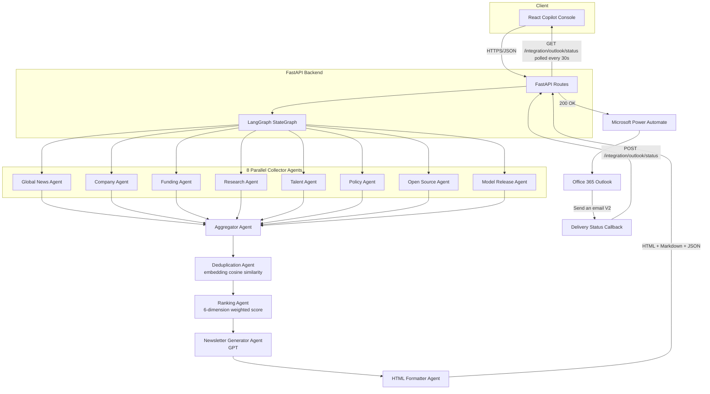

# System Architecture

## Layered Overview

```
Frontend (React Copilot console)
        │  HTTPS / JSON
        ▼
FastAPI (async Python backend, OpenAPI/Swagger-first)
        │
        ▼
LangGraph (compiled StateGraph orchestration)
        │
        ▼
AI Agents (8 parallel collectors)
        │
        ▼
Semantic Search (embedding-based deduplication)
        │
        ▼
GPT (executive summary, per-article summaries, subject line)
        │
        ▼
HTML Formatter (HTML + Markdown + JSON rendering)
        │
        ▼
Power Automate (scheduled trigger + delivery orchestration)
        │
        ▼
Outlook (Office 365 "Send an email (V2)")
```

Every layer is independently replaceable: the frontend only calls
documented REST endpoints, FastAPI only depends on the compiled LangGraph
workflow, and Power Automate only depends on the HTTP contract described in
[`06_API_Documentation.md`](06_API_Documentation.md). No layer reaches
"through" another.

## Mermaid Architecture Diagram



## Component Responsibilities

| Component | Responsibility |
|---|---|
| **React Copilot Console** | Chat-first UI to trigger runs, watch execution, review results, and monitor the Power Automate/Outlook delivery pipeline |
| **FastAPI Backend** | HTTP contract, authentication, request validation, response shaping, Swagger/OpenAPI documentation |
| **LangGraph StateGraph** | Deterministic orchestration: fan-out to 8 collectors, fan-in, sequential aggregation → dedup → ranking → generation → formatting |
| **8 Collector Agents** | Category-scoped data collection from external sources, with per-agent failure isolation |
| **Aggregator Agent** | Fan-in: merges all 8 collectors' output into a single article list |
| **Deduplication Agent** | Removes near-duplicate stories via embedding cosine similarity |
| **Ranking Agent** | Scores and selects the top articles per category across 6 weighted dimensions |
| **Newsletter Generator Agent** | GPT-driven executive summary, per-article summaries, subject line generation |
| **HTML Formatter Agent** | Renders the final HTML (Jinja2), Markdown, and JSON payloads |
| **Power Automate** | Daily scheduling, HTTP orchestration, Outlook delivery, delivery-status callback |
| **Outlook (Office 365)** | Actual email transport to the distribution list |

## Why LangGraph

This is a **deterministic multi-agent workflow**, not an open-ended
conversational agent loop — the set of steps, their order, and their
fan-out/fan-in shape are fixed at compile time. LangGraph's `StateGraph` is
purpose-built for exactly that:

- **Shared state** — a single typed `GraphState` flows through every node;
  each collector writes to its own dedicated key, so no coordination code
  is needed to avoid write conflicts.
- **Parallel execution** — the orchestrator has an edge to all eight
  collector nodes; LangGraph runs them concurrently in the same superstep.
- **Retry support** — outbound HTTP calls retry transient failures with
  exponential backoff; a graph-level `RetryPolicy` is additionally attached
  to the nodes that call the LLM directly.
- **Conditional routing** — after ranking, the graph routes to the
  newsletter generator on the normal path, or to a no-content fallback if
  nothing cleared the relevance bar for that run.
- **Aggregation** — all eight collector edges converge on a single
  aggregator node, executed only once every predecessor for that superstep
  has completed.

Full technical detail (including the LangGraph execution report surfaced
in every API response) is in [`03_AI_Pipeline.md`](03_AI_Pipeline.md).

## Data Flow Summary

| Stage | Input | Output |
|---|---|---|
| Collection | External source APIs/feeds | Raw `Article` objects per category |
| Aggregation | 8 categories' article lists | One merged article list |
| Deduplication | Merged article list | De-duplicated article list (freshest copy kept) |
| Ranking | De-duplicated article list | Top-N articles per category, scored |
| Generation | Ranked articles | Structured newsletter content (subject, summary, sections) |
| Formatting | Structured content | HTML, Markdown, JSON |
| Delivery | HTML | Sent email + delivery status callback |

## Deployment Topology

The backend and frontend are independently deployable:

- **Backend**: any container host with a public HTTPS endpoint (see
  [`07_Deployment_Guide.md`](07_Deployment_Guide.md)) — Docker image
  included.
- **Frontend**: a static build (Vite output) servable from any static
  host or the included Nginx container.
- **Power Automate**: runs entirely within Microsoft's cloud; it only
  needs the backend's public URL and an API key.

No component requires a shared database — newsletter history and delivery
status are filesystem-backed JSON, suitable for a single-instance
deployment (see [`10_Future_Roadmap.md`](10_Future_Roadmap.md) for the
planned database-backed evolution).
