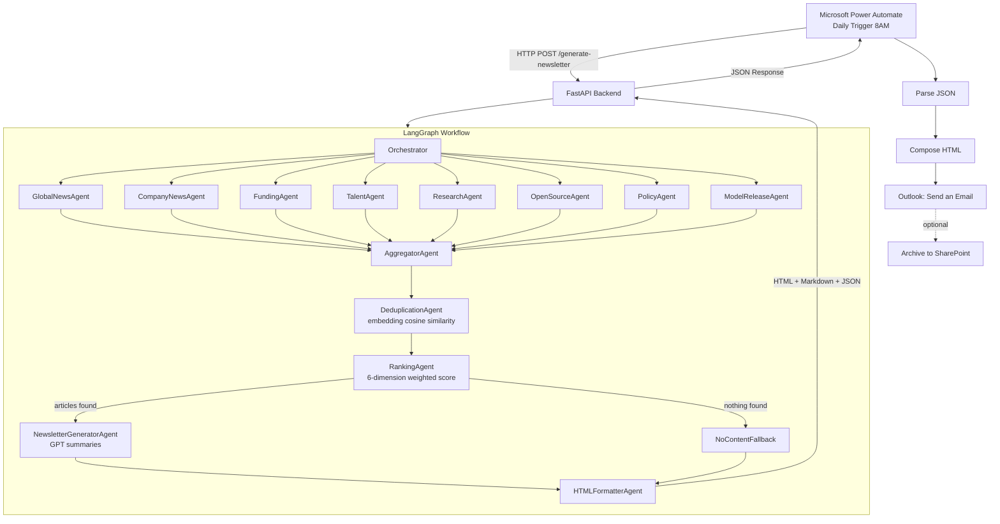
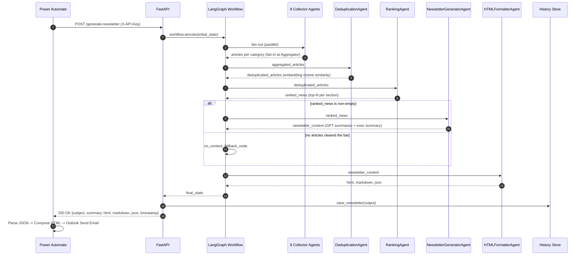

# Architecture

## Overview

AI Newsletter Automation is a multi-agent pipeline orchestrated with
[LangGraph](https://github.com/langchain-ai/langgraph). Every day, Microsoft
Power Automate calls a single FastAPI endpoint, which runs a compiled
`StateGraph` that fans out to eight parallel collector agents, merges and
deduplicates their output, ranks the result across six weighted dimensions,
and generates a GPT-summarized executive newsletter in HTML, Markdown, and
JSON.

## Why LangGraph

This is a **deterministic multi-agent workflow**, not an open-ended
conversational agent loop - the set of steps, their order, and their
fan-out/fan-in shape are fixed at compile time. LangGraph's `StateGraph` is
built exactly for that:

- **Shared state** - a single typed `GraphState` (`app/models/state.py`)
  flows through every node; each collector writes to its own dedicated key,
  so no coordination code is needed to avoid write conflicts.
- **Parallel execution** - the orchestrator has an edge to all eight
  collector nodes; LangGraph runs them concurrently in the same superstep.
- **Retry support** - `RetryPolicy` is attached to every node that performs
  network or LLM calls (`app/graph/workflow.py`), with exponential backoff.
- **Conditional routing** - after ranking, `route_after_ranking` sends the
  graph either to `newsletter_generator` (normal path) or
  `no_content_fallback` (nothing cleared the relevance bar).
- **Aggregation** - all eight collector edges converge on a single
  `aggregator` node, which LangGraph only executes once every predecessor
  for that superstep has completed (fan-in).

AutoGen and similar conversational-agent frameworks are built around agents
negotiating a plan at runtime, which is the wrong tool for a fixed daily ETL
pipeline where the accountability, retries, and data flow need to be
explicit and inspectable.

## System Architecture

## Sequence Diagram

## Agents

| Agent | Role | Category / State key |
|---|---|---|
| `GlobalNewsAgent` | Publisher RSS (TechCrunch, VentureBeat, MIT Tech Review, The Verge, Reuters via Google News) + NewsAPI | `global_news` |
| `CompanyNewsAgent` | Per-company Google News RSS (OpenAI, Anthropic, Microsoft AI, DeepMind, Meta AI, NVIDIA, Amazon AI, xAI) | `company_news` |
| `FundingAgent` | Crunchbase API (if key present) or Google News fallback | `funding` |
| `TalentAgent` | Greenhouse + Lever public job boards, LinkedIn provider (mock/api) | `talent` |
| `ResearchAgent` | arXiv API (`cs.AI`, `cs.LG`, `cs.CL`) | `research` |
| `OpenSourceAgent` | GitHub Search API (trending) + Hugging Face Hub API | `opensource` |
| `PolicyAgent` | Google News RSS + NewsAPI (EU AI Act, India AI Mission, US AI Executive Orders) | `policy` |
| `ModelReleaseAgent` | Google News RSS per lab (new model announcements) | `model_releases` |
| `AggregatorAgent` | Merges all eight collector outputs | - |
| `DeduplicationAgent` | Embedding cosine-similarity dedup | - |
| `RankingAgent` | 6-dimension weighted scoring, top-N per section | - |
| `NewsletterGeneratorAgent` | GPT per-article summaries, executive summary, subject line, "one thing to watch" | - |
| `HTMLFormatterAgent` | Renders Jinja2 HTML, Markdown, and JSON | - |

Every collector inherits `BaseCollectorAgent` (`app/agents/base_agent.py`),
which isolates exceptions per-agent (one broken source never fails the run),
filters out stale articles (`MAX_ARTICLE_AGE_HOURS`), and logs timing.

## Shared State

`GraphState` (`app/models/state.py`) is a `TypedDict` with one list field per
collector category, plus pipeline fields (`aggregated_articles`,
`deduplicated_articles`, `ranked_news`, `newsletter_content`,
`newsletter_html`, `newsletter_markdown`, `newsletter_json`) and two
observability fields, `execution_logs` and `errors`, both annotated with an
`operator.add` reducer so LangGraph concatenates entries written
concurrently by parallel branches instead of overwriting them.

## Deduplication

`DeduplicationAgent` embeds every article's title + snippet via the LLM
service's `embed_texts`, sorts articles freshest-first, and greedily keeps an
article only if its cosine similarity to every already-kept article is
below `DEDUP_SIMILARITY_THRESHOLD` (default `0.88`). This means the most
recent copy of a story reported by multiple publishers survives.

## Ranking

`RankingAgent` scores every article across six dimensions and combines them
via configurable weights (`RANKING_WEIGHT_*` env vars):

- **Freshness** - linear decay over `MAX_ARTICLE_AGE_HOURS`.
- **Importance** - keyword density (`breakthrough`, `unveils`, `milestone`, ...).
- **Business impact** - keyword density (`funding`, `acquisition`, `IPO`, ...).
- **Source credibility** - static registry (`app/config/sources.py:SOURCE_CREDIBILITY`) with a per-category default fallback.
- **Research impact** - category-aware (boosted for `research`/`model_releases`) plus keyword density (`benchmark`, `sota`, ...).
- **AI relevance** - keyword density against a curated AI-terms list.

The top `RANKING_TOP_STORIES_PER_SECTION` articles per category are kept,
and `NewsletterGeneratorAgent` applies one more global cap
(`NEWSLETTER_MAX_TOTAL_ARTICLES`) so the rendered newsletter stays to
roughly two pages.
